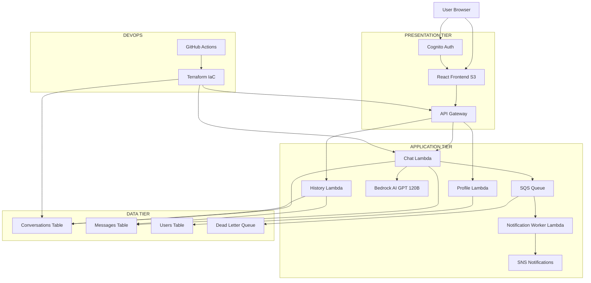
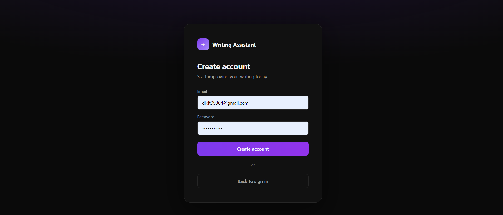
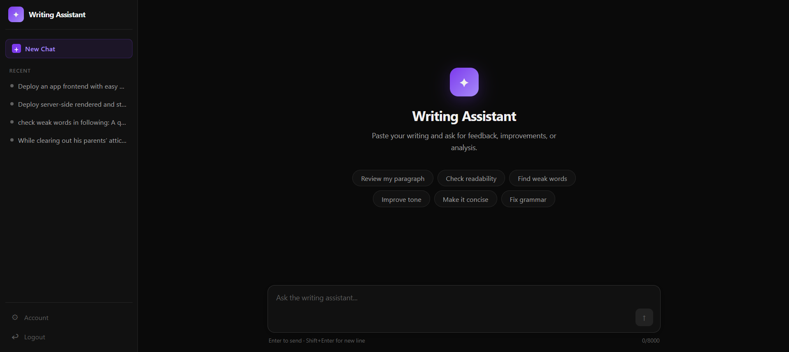
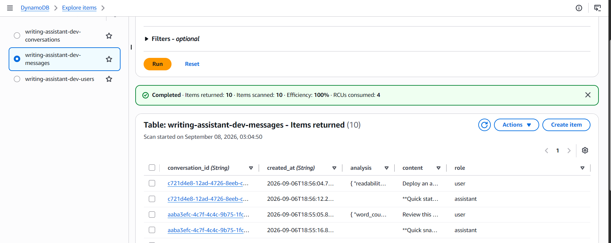

# Bedrock Writing Assistant

## Overview

The Bedrock Writing Assistant is a production-ready, serverless AI writing feedback platform built entirely on AWS infrastructure. It leverages Amazon Bedrock's OpenAI-compatible endpoint to power an OpenAI GPT-OSS 120B model that analyzes writing quality through deterministic text analysis (word count, readability scores, weak words detection, long sentence identification, and repeated word highlighting) combined with intelligent AI-driven suggestions. The application features a React + TypeScript frontend hosted on S3, secure user authentication via Amazon Cognito with SRP and JWT tokens, serverless Python Lambda functions for API logic, DynamoDB for persistent storage of users, conversations, and messages, asynchronous event processing through SQS and SNS for notifications, and a fully automated CI/CD pipeline using GitHub Actions and Terraform. Users register, verify their email, log in to receive JWT tokens, submit writing samples through a chat interface that displays real-time AI feedback alongside conversation history, and benefit from a scalable, pay-per-request architecture deployed in the ap-south-1 (Mumbai) region with structured error handling, dead-letter queues, and comprehensive CloudWatch logging.

---

## Tech Stack

| Layer | Technology |
|-------|-----------|
| Frontend | React 18 + TypeScript + Vite |
| Auth | Amazon Cognito (SRP) + `amazon-cognito-identity-js` |
| API | API Gateway HTTP API (v2) |
| Backend | Python 3.12 Lambda |
| AI Model | `openai.gpt-oss-120b` via Bedrock OpenAI-compatible endpoint |
| Database | DynamoDB (PAY_PER_REQUEST) |
| Async | SQS + Lambda event source mapping |
| Notifications | SNS |
| Hosting | S3 Static Website |
| Infrastructure | Terraform >= 1.9 |
| CI/CD | GitHub Actions |
| Region | `ap-south-1` (Mumbai) |

---

## AWS Services

| Service | Usage |
|---------|-------|
| **Amazon Cognito** | User pool, SRP authentication, JWT tokens |
| **API Gateway HTTP API** | REST endpoints with JWT authorizer |
| **AWS Lambda** | chat, history, profile, notification-worker functions |
| **Amazon Bedrock** | OpenAI-compatible endpoint for GPT-OSS 120B |
| **DynamoDB** | Users, conversations, messages tables |
| **SQS** | Async notification queue with DLQ |
| **SNS** | Notification topic for downstream events |
| **S3** | Frontend static website hosting |
| **CloudWatch** | Lambda logs (14-day retention) |
| **IAM** | Lambda execution roles, GitHub Actions user |
| **Lambda Layers** | `openai` Python package |

---

## AWS Architecture



---

## Application Flow

### Register

```
User fills email + password
        ↓
Cognito.signUp()
        ↓
AWS sends verification email
        ↓
User enters 6-digit code
        ↓
Cognito.confirmRegistration()
        ↓
Account activated → redirect to login
```

### Login

```
User fills email + password
        ↓
Cognito SRP authentication
(ALLOW_USER_SRP_AUTH)
        ↓
Cognito returns JWT tokens
(ID token, Access token, Refresh token)
        ↓
Frontend stores session
        ↓
ID token attached to all API requests
as Bearer in Authorization header
        ↓
API Gateway validates JWT
        ↓
Lambda receives user sub (user_id) from claims
```

### Chat

```
User types message → Enter or Send
        ↓
frontend/src/api.ts → POST /chat
Authorization: Bearer <JWT>
        ↓
API Gateway validates JWT
        ↓
chat Lambda handler
        ↓
├── analyze_text() — deterministic tools
│       ├── word_count
│       ├── readability_score (Flesch)
│       ├── find_weak_words
│       ├── find_long_sentences
│       └── find_repeated_words
│
├── DynamoDB — save user message + analysis
│
├── Bedrock OpenAI endpoint
│   POST /chat/completions
│   model: openai.gpt-oss-120b
│   (system prompt + writing + analysis)
│       ↓
│   AI response text
│
├── DynamoDB — save assistant message
│
└── SQS — publish chat.completed event
        ↓
        Worker Lambda
        ↓
        SNS publish

        ↓
200 response to frontend
{ conversation_id, message, analysis }
        ↓
Chat bubble rendered
History refreshed in sidebar
```

### Conversation History

```
On login / new conversation
        ↓
GET /conversations
        ↓
history Lambda queries DynamoDB
conversations table (user_id = sub)
        ↓
Sidebar displays list sorted by updated_at
        ↓
User clicks conversation
        ↓
GET /conversations/{conversation_id}
        ↓
history Lambda returns messages[]
        ↓
Chat component renders full thread
```

---

## Project Structure

```
bedrock-writing-assistant/
├── .github/
│   └── workflows/
│       ├── terraform.yml        # Terraform CI/CD
│       └── frontend.yml         # Frontend build + S3 deploy
│
├── backend/
│   ├── chat/
│   │   └── handler.py           # Chat Lambda (Bedrock + DynamoDB + SQS)
│   ├── history/
│   │   └── handler.py           # History Lambda
│   ├── profile/
│   │   └── handler.py           # Profile Lambda
│   ├── notification_worker/
│   │   └── handler.py           # SQS → SNS worker
│   ├── tools/
│   │   ├── __init__.py
│   │   └── writing_tools.py     # Deterministic text analysis
│   └── requirements.txt
│
├── frontend/
│   ├── src/
│   │   ├── components/
│   │   │   ├── Login.tsx
│   │   │   ├── Register.tsx
│   │   │   ├── VerifyEmail.tsx
│   │   │   ├── Chat.tsx
│   │   │   └── Account.tsx
│   │   ├── styles/
│   │   │   └── app.css
│   │   ├── App.tsx
│   │   ├── auth.ts              # Cognito auth helpers
│   │   ├── api.ts               # API client
│   │   ├── main.tsx
│   │   └── types.ts
│   ├── .env.example
│   └── index.html
│
├── terraform/
│   ├── environments/
│   │   └── dev.tfvars
│   ├── main.tf                  # locals
│   ├── variables.tf
│   ├── outputs.tf
│   ├── providers.tf
│   ├── versions.tf
│   ├── cognito.tf
│   ├── dynamodb.tf
│   ├── iam.tf
│   ├── lambda.tf
│   ├── api_gateway.tf
│   ├── sqs.tf
│   ├── sns.tf
│   ├── s3.tf
│   ├── cloudfront.tf.disabled   # re-enable after account verification
│   └── frontend.tf
│
├── commands.md
├── issues-and-solutions.md
└── README.md
```

---

## Commands

### Prerequisites

```bash
git --version
aws --version
terraform version
node --version
python --version
aws sts get-caller-identity
```

### Terraform

```bash
cd terraform

# First time
terraform init
terraform fmt -recursive
terraform validate
terraform plan -var-file=environments/dev.tfvars

# Apply (sensitive key via separate file)
terraform apply -var-file=environments/dev.tfvars -var-file=secret.tfvars

# View outputs
terraform output

# Destroy
terraform destroy -var-file=environments/dev.tfvars -var-file=secret.tfvars
```

### Lambda Layer (build locally with Docker)

```bash
# Build Linux-compatible layer
docker run --rm \
  -v "$(pwd)/backend/lambda_layers:/output" \
  python:3.12-slim \
  pip install openai -t /output/python

# Zip it
cd backend/lambda_layers
zip -r openai_layer.zip python
```

### Frontend

```bash
cd frontend

# Install
npm install

# Dev server
npm run dev

# Build
npm run build

# Deploy to S3
aws s3 sync dist "s3://<your-bucket>" --delete --region ap-south-1
```

### Git

```bash
git add .
git commit -m "your message"
git push origin main
```

---

## Environment Variables

### Frontend (`frontend/.env`)

```env
VITE_AWS_REGION=ap-south-1
VITE_COGNITO_USER_POOL_ID=ap-south-1_KkZk2wCuC
VITE_COGNITO_CLIENT_ID=4v6pcaksi0gvgeneqditd214j1
VITE_API_URL=https://p5tlyx6tlh.execute-api.ap-south-1.amazonaws.com
```

### Lambda Environment Variables (set via Terraform or console)

| Variable | Description |
|----------|-------------|
| `BEDROCK_MODEL_ID` | `openai.gpt-oss-120b` |
| `OPENAI_API_KEY` | Bedrock bearer token |
| `OPENAI_BASE_URL` | `https://bedrock-mantle.us-east-1.api.aws/v1` |
| `CONVERSATIONS_TABLE` | DynamoDB table name |
| `MESSAGES_TABLE` | DynamoDB table name |
| `NOTIFICATION_QUEUE_URL` | SQS queue URL |

### GitHub Actions Secrets

| Secret | Description |
|--------|-------------|
| `AWS_ACCESS_KEY_ID` | IAM user access key |
| `AWS_SECRET_ACCESS_KEY` | IAM user secret key |
| `OPENAI_API_KEY` | Bedrock bearer token |

---

## Deployed Resources

| Resource | Value |
|----------|-------|
| API URL | `https://p5tlyx6tlh.execute-api.ap-south-1.amazonaws.com/` |
| Cognito User Pool | `ap-south-1_KkZk2wCuC` |
| Cognito Client | `4v6pcaksi0gvgeneqditd214j1` |
| Frontend Bucket | `writing-assistant-dev-fe-478685e60a152e6bfe17ef28b9` |
| Frontend URL | `http://writing-assistant-dev-fe-478685e60a152e6bfe17ef28b9.s3-website.ap-south-1.amazonaws.com` |
| Region | `ap-south-1` |
| Model | `openai.gpt-oss-120b` |

---

## Screenshots

### User Registration

*New users can register with email and password. Amazon Cognito handles user pool management and sends verification codes.*

### Email Verification

*After registration, users receive a 6-digit verification code via email to activate their account.*

### Chat Interface

*The main chat interface where users submit writing samples and receive AI-powered feedback with text analysis (word count, readability, weak words, long sentences) and intelligent suggestions.*

### DynamoDB Tables

*Backend data persistence layer showing the three DynamoDB tables: users, conversations, and messages with PAY_PER_REQUEST billing mode.*

---

## Known Limitations

- CloudFront is disabled — AWS account pending verification. See `terraform/cloudfront.tf.disabled` to re-enable.
- OIDC GitHub Actions auth is disabled — AISPL accounts block `sts:AssumeRoleWithWebIdentity`. Using long-lived access keys instead.
- The Bedrock API key (`OPENAI_API_KEY`) is a pre-signed bearer token with a 12-hour expiry. Regenerate from the Bedrock console when it expires.
- Terraform state is stored in S3 (`writing-assistant-dev-terraform-state`). Do not run apply from two machines simultaneously.
